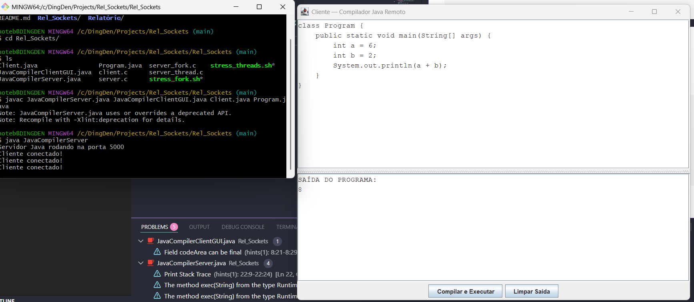

# Rel_Sockets_Linux  
Sistema de comunicação Cliente–Servidor com múltiplas abordagens (C e Java)

Este repositório contém um conjunto de implementações de comunicação entre processos utilizando **sockets TCP** e diferentes modelos de concorrência, incluindo:

- Servidor sequencial (C)
- Servidor concorrente por *fork* (C)
- Servidor concorrente por *threads* (C)
- Cliente em C (terminal)
- Cliente em Java (GUI Swing)
- Servidor compilador em Java (compila e executa código enviado pelo cliente)

O projeto foi desenvolvido como estudo prático de **comunicação entre processos**, **concorrência**, **sincronização**, **transmissão de dados**, e **execução remota de programas**.

## ✅ Pré‑requisitos

- Linux (ou ambiente que suporte sockets BSD / POSIX).  
- Compilador C (gcc, clang etc.), se for compilar partes em C.  
- JDK instalado, se for compilar/rodar partes Java.  
- (Opcional) Ferramentas de build/scripts se houver.

---

## 📌 Estrutura do Repositório
```
Imagens/
├── exemploClienteGUI.png
Relatório/
├── Relatório - Sockets em Linux - Equipe Java.pdf
Rel_Sockets/
├── client.c                    # Cliente TCP simples (C)
├── server.c                    # Servidor sequencial
├── server_fork.c               # Servidor concorrente via fork()
├── server_thread.c             # Servidor concorrente via threads
├── JavaCompilerServer.java     # Servidor remoto que compila e executa código Java
├── JavaCompilerClientGUI.java  # Cliente GUI em Java
├── Program.java                # Programa simples para teste de compilação remota
├── stress_fork.sh              # Script de teste de carga (fork)
├── stress_threads.sh           # Script de teste de carga (threads)
README.md
```

---

## Como Executar (Linux)

### 1. Compilar servidores e cliente em C

```bash
gcc server.c -o server
gcc server_fork.c -o server_fork
gcc server_thread.c -o server_thread -lpthread
gcc client.c -o client
```

### 2. Executar os servidores

```bash
# Server com fork
./server_fork 5051

# ou esse, caso queira testar o server com thread
./server_thread 5050
```

### 3. Conectar com o cliente em C

```bash
# Utilizando outro terminal diferente do servidor, realize a conexão
./client 127.0.0.1 5050
# ou
./cliente 127.0.0.1 5051
```

### (OPCIONAL ) 4. Use o estresse para 10 mil requisições
```bash
# Estresse para o server fork
./stress_fork.sh

# ou esse, para o server threads (por conexão)
./stress_threads.sh
```

---

## Cliente/Servidor Java (compilação remota)

### 1. Compile os arquivos em Java

```bash
javac JavaCompilerServer.java JavaCompilerClientGUI.java
```

### 2. Inicie o Servidor Java

```bash
# Em um terminal, inicie o servidor. Já está alocado na porta 5000 pelo código
java JavaCompilerServer
```

### 3. Iniciar o cliente GUI

```bash
# Em outro terminal, realize a conexão cliente com o servidor (porta 5000)
java JavaCompilerClientGUI
```

### 4. Teste básico
No cliente GUI cole o código do programa java disponibilizado: Program.java
```bash
class Program {
    public static void main(String[] args) {
        int a = 6;
	int b = 2;
	System.out.println(a + b);
    }
}
```
Saída (exemplo)


## Autores
1. Antonio Henrique
2. Daniel Diniz
3. Isabel dos Reis 